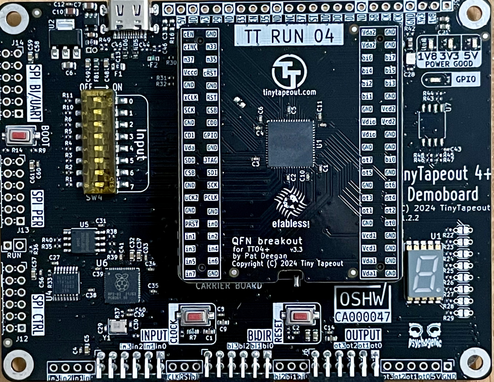
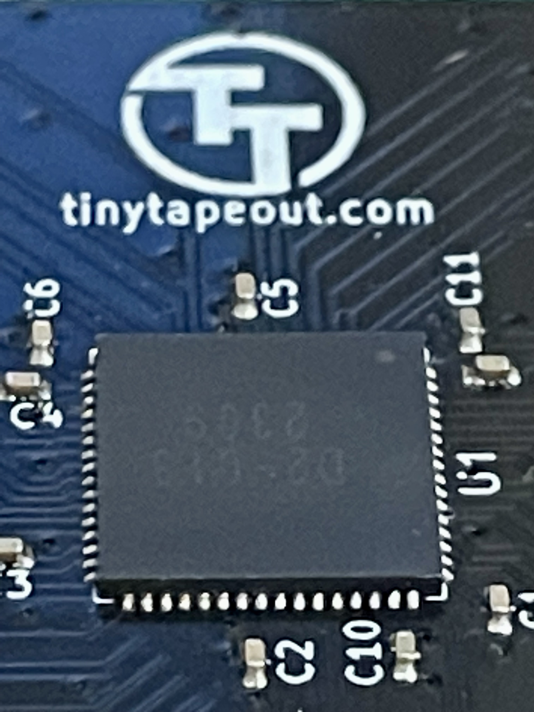

  

# Binarized LIF Neuron from Telluride Neuromorphic Workshop 2023

This is a standalone test for a Binarized Leaky Integrate and Fire (BLIF) neuron implemented in silicon. The neuron was developed during the [Telluride Neuromorphic Workshop 2023](https://sites.google.com/view/telluride-2023/home) and is part of a larger experiment ["The Huge Neural Network On-Chip"](https://github.com/rejunity/tt05-snn).

The design goals behind BLIF neuron were to **minimize the silicon area** and to use FOSS design process.

The BLIF neuron with 8 synapses
* consits of 191 logic gates and
* covers 0.003 square millimeters using [Sky130 nm](https://skywater-pdk.readthedocs.io/en/main/)

In other words 300 neurons and 2400 synapses could fit in 1 square millimeter on [Sky130 nm](https://skywater-pdk.readthedocs.io/en/main/) process.


## Hot it works

Binarized Leaky Integrate and Fire (BLIF) neuron supports binary {0/1} inputs and {-1/1} binarized weights.
Inputs are multiplied by weights and accumulated on the internal membrane. Membrane is exponentially decaying with every clock cycle.
Once membrane value (potential) reaches threshold, neuron spikes and membrane value is decreased.

```
membrane += inputs * weights
membrane *= decay_factor
spike = 1             if membrane > threshold
membrane -= threshold if membrane > threshold

```


## ASIC tapeout

Binarized Leaky Integrate and Fire (BLIF) neuron was tapedout on [FOSS 130nm Production process](https://skywater-pdk.readthedocs.io/en/main/) via [Tiny Tapeout](https://tinytapeout.com/runs/tt04/) initiative.

### Testing board with the BLIF neuron chip


### Closeup of the QFN64 130nm chip with the BLIF neuron


# The team
  - Dr. Paola Vitolo
  - Dr. Andrew Wabnitz
  - ReJ aka Renaldas Zioma

# Topic Leader
  - [Prof. Jason Eshraghian](https://ncg.ucsc.edu/jason-eshraghian-bio/)
